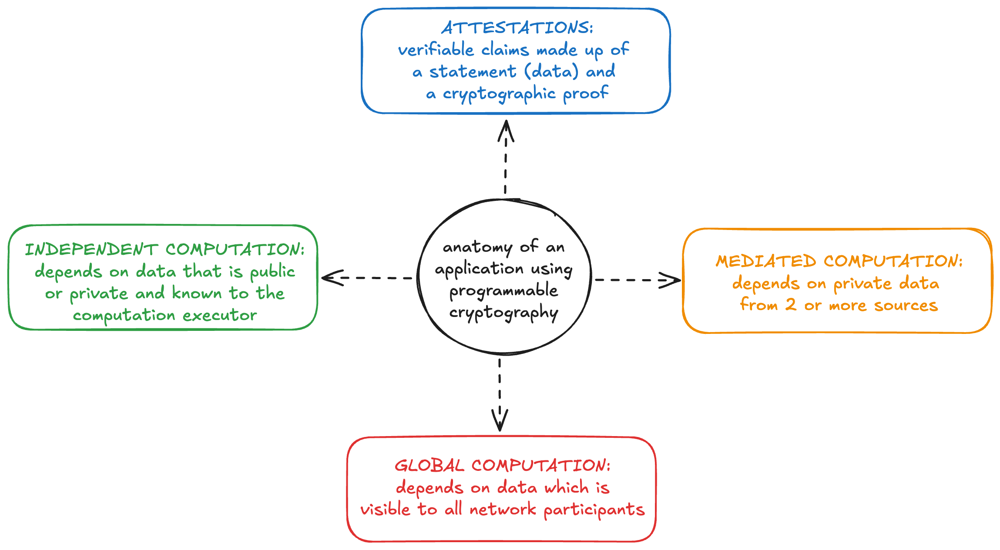

# Building applications

Resilient application engineering depends on a shared knowledge base of design patterns that guide development at all levels of the system and software architecture stack. As design patterns have been established for web 2.0 applications, an ecosystem of modular software services has grown to help developers manage and isolate the complexities of different requirements, from auth to databases to hosting and serving applications.

The world of programmable cryptography is just beginning to open, which means that design patterns for leveraging these cryptographic tools haven't been discovered or established yet, and there are limited services or tools available to support non-cryptographers in building applications that make use of programmable cryptography.

A major goal of this wiki is to provide a reference for existing patterns and tools and to help guide the discussion and discovery of what is needed.

## A framework for thinking about programmable cryptography

We can think about application design that leverages programmable cryptography in terms of the affordances that programmable cryptography enables, the interactivity requirements between actors in the system, and how private data is shared and managed. 

We use the computation framework introduced in the [Programmable Privacy SoK](https://eprint.iacr.org/2024/982.pdf), which noted that existing applications with programmable privacy have 3 phases of computation: independent, mediated, and global.

- Independent computation is performed by a single entity and depends on input data that is either public or private but known to that entity (*personal* private data)
- Mediated computation is used when private data from multiple sources must interact or be combined without being revealed. 
- Global computation uses public data in decentralized computation, such as on a blockchain or in a peer-to-peer system.

For our purposes, we prefer to think of these as separate building blocks which may or may not be used in any given application and which do not have strict temporal requirements. In other words, while many applications will begin with an independent computation phase, continue to mediated computation, and end with global computation, others might finish with independent computation or use only 1 of these 3 types. As tools become more robust and applications become more complex, the variety of ways in which these building blocks are combined will increase.

Finally, to this framework we add our final building block: attestations, also known as attested or verifiable data. While some applications will not require input data to be attested to, many more will, which means that we need to understand (and expand) the available sources of attestations and have good tools for manipulating them.