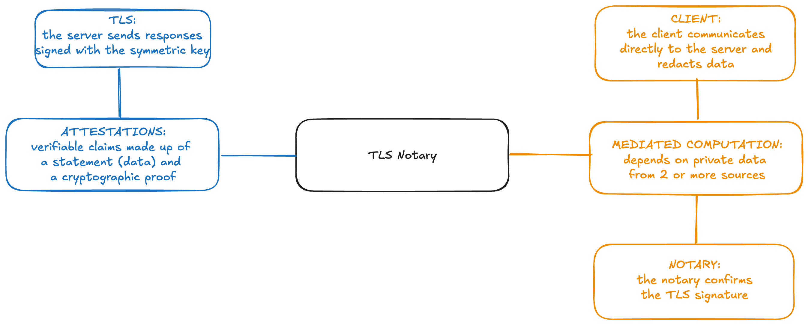

# Tools

Tools are meant for a particular function and by themselves are incomplete. Tools are agnostic of how or where they are used.

# Web Data Provenance

| Name | Summary | Limitations | Notes | Link |
|--|--|--|--|--|
|Zeko| Collect commitments from web2 platforms for private airdrop | | | | [Link](https://github.com/enricobottazzi/Zeko) |
| ZKEmail | Prove receipt of an email| | | [Link](https://github.com/zkemail) |
| TLSNotary | Generate attestations over arbitrary data obtained over a TLS connection (e.g. API responses) | Requires a trusted verifier (the “notary”) | | [Link](https://tlsnotary.org/) |

# ZKML 
| Name | Summary | Limitations | Notes |Link |
| ---- | ------- | ----------- | -- | ----- |
| EZKL | Prove the inference of a ML model | Practical limit <1B parameters | | [Link](https://github.com/zupzup/ezkl) |

# Identity
| Name | Summary | Limitations | Notes | Link |
| ---- | ------- | ----------- | --- | ----- |
| zuAuth | A simple package designed to streamline the development of a zero-knowledge authentication system with Zupass tickets. | | | [Link](https://github.com/cedoor/zuauth) |
| Semaphore | prove their group membership and send signals such as votes or endorsements without revealing their original identity. | | | [Link](https://semaphore.pse.dev/) |