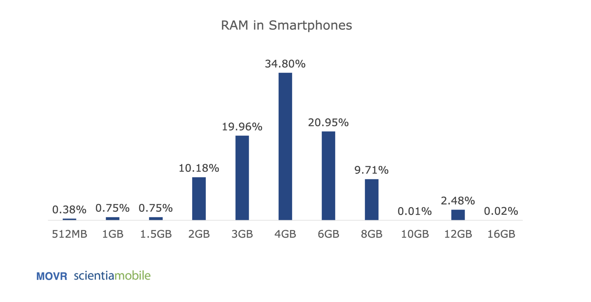
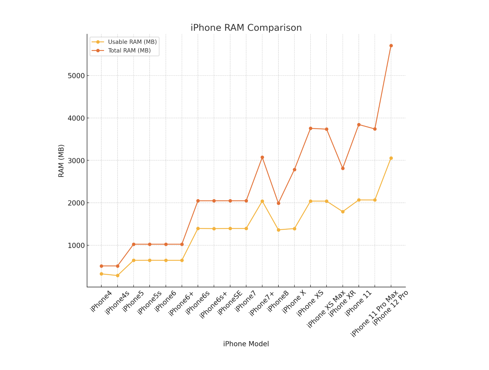

# Mobile Proving

The following information comes from a presentation made by [Théo Madzou](https://github.com/madztheo). Mobile Proving is an active area of both research and development. Developer tooling remains in the early days. 
Here we outline the current state of its practical use and remaining challenges in regards to usability and performance.

## Use Cases

- Geolocation: proof of location
    - iOS only gives you high-level access through their API, whereas Android gives you low-level data from the phone's GPS. Web can give you limited access to location. Proving that this data came from the users particular phone requires augmenting this data with something like Apple's App Attest.
- Reading NFC chips: biometric passports and ID cards, debit/credit cards
    - You need a native app to read NFC chips. This makes NFC a "true mobile" use case. 
- Taking photos and videos: proof of taking a real photo or video (i.e. not generated by AI)
- Bluetooth: proof of proximity (e.g. contact tracing)
- Secure Element: leverage secure element’s cryptography to improve UX

## Current Limitations

The two major constraints facing mobile proving are:
- the limited amount of RAM 
- the lack of dedicated, general GPU. 

The combination of these two factors means succesful mobile proving requires breaking up proofs into smaller, highly-optimised circuits, sequentially proving them and then aggregating them into a single recursive proof. This typically works around the 2GB RAM limit, but at the cost of additional proving time.

### Limited RAM
The major constraint on current mobile proving is the limited amount of RAM on mobile devices. This cannot be alleviated by "swap" because this typically isn't available on mobile devices. Apps will just crash if they run out of memory. It is possible to create a "swap" like affordance but requires manual work and is not directly handled for you by the OS.

 [Source](https://www.scientiamobile.com/how-much-ram-is-in-smartphones/)
 [Source](https://stackoverflow.com/questions/5887248/ios-app-maximum-memory-budget)

Based on the images above we see that for the general mobile user, the *usable* amount of RAM is roughly around ~2-2.5GB. This means mobile proving is an even more constricted environment than in the browser where WASM environments create a limit at 4GB.

It *may* be possible to declare in the manifest for iOS apps that your app requires a "high" amount of memory. This value is `com.apple.developer.kernel.increased-memory-limit.`

### Large Proving Keys
Depending on the tool stack being used, proving keys may need to be bundled with the app. These tend to be large, for example the key for the RSA circuit in OpenPassport is ~300MB. Either you put it in the binary, which makes the app size large or you download it which takes up lots of mobile data. Furthermore, modular circuits in Circom may have multiple proving keys, which exacerbates the problem.

For Noir (or tooling which uses a universal trusted setup) will require a SRS. This SRS can be large as well (32MB), though it may not be as large as the proving keys in Circom. The proving keys in Noir for the circuits are created on the fly. These proving keys are as large as the proving keys in Circom and are loaded into RAM. They may be several GBs in size and this is a source of pressure on the RAM.

## Future Work

**Collaborative zkSNARKs**
We can potentially generate the witness locallyand offload the majority of the computation to a proving committee.

**Simplifying Recursion** 
Automating the process of splitting proofs into multiple proofs and aggregating them at the end would streamline the developer flow in mobile proving. o1js is a good reference for how to do this recursion in a developer friendly way.

# Projects 
[React Native Starter Kit](https://github.com/madztheo/noir-react-native-starter)
[MoPro](https://github.com/zkmopro/mopro)
[RapidSnark](https://github.com/iden3/rapidsnark)

